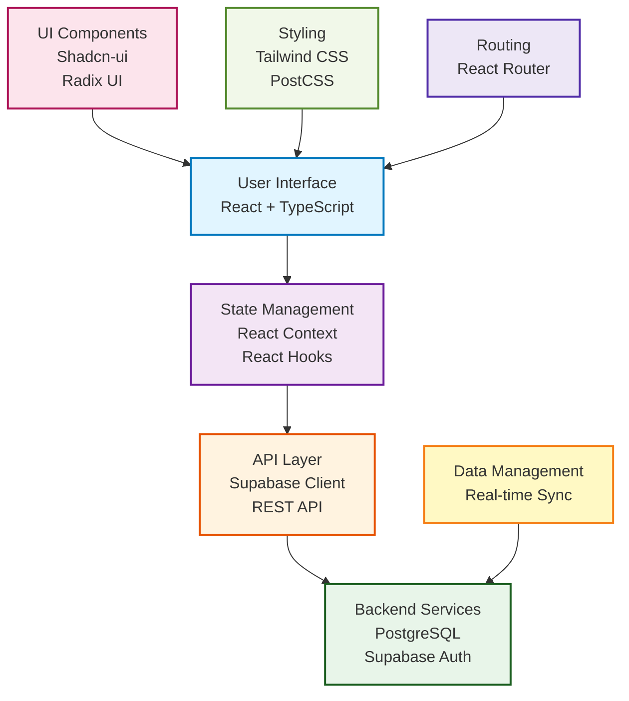
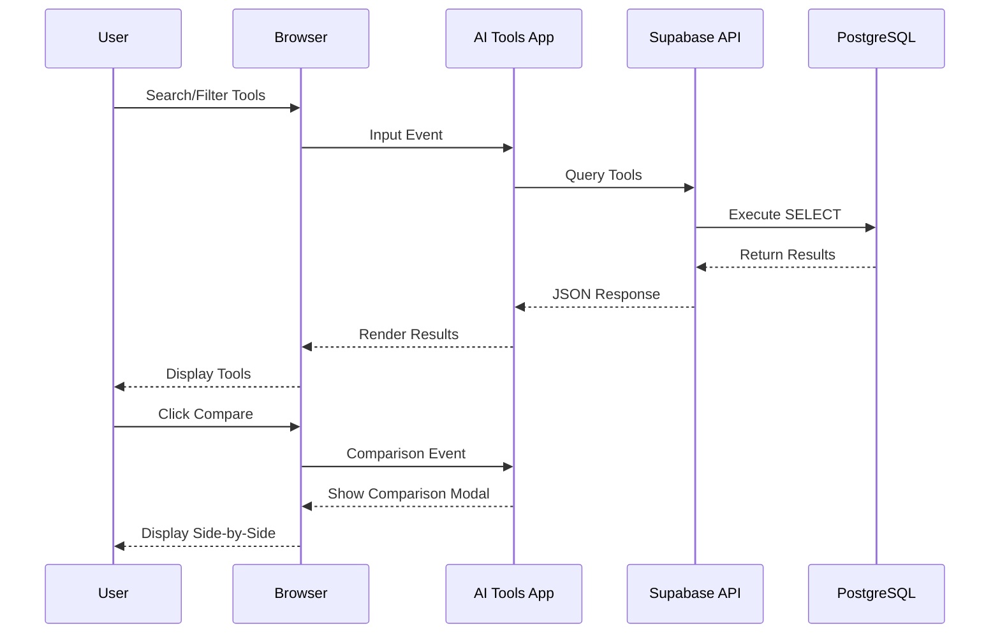
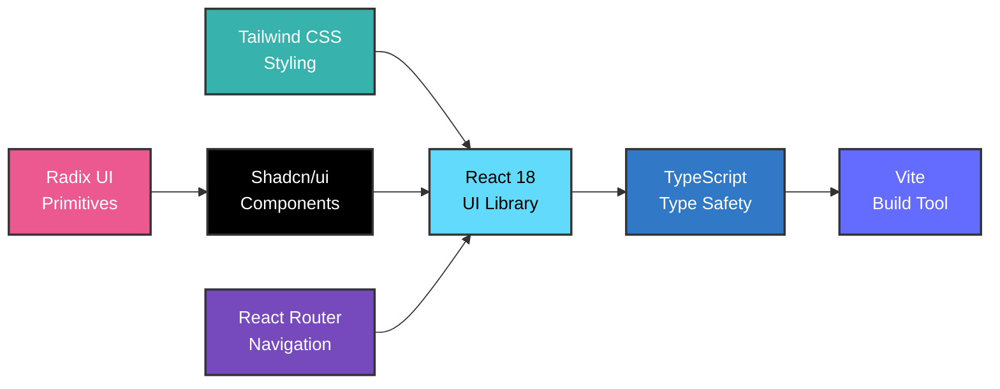

# AI Tools Explorer

<div align="center">
  <strong>Discover, Compare & Recommend the Perfect AI Tools</strong>
  <br>
  <em>A modern web application for finding the ideal AI tools for your projects</em>
  <br><br>
  
  
  
  
  
  <br>
  <a href="https://ai-tool-explorer-three.vercel.app/" target="_blank"><strong>🚀 Live Demo</strong></a>
</div>

---

## 📖 Table of Contents

- [Overview](#overview)
- [Features](#features)
- [System Architecture](#system-architecture)
- [Tech Stack](#tech-stack)
- [Project Structure](#project-structure)
- [Getting Started](#getting-started)
- [Available Scripts](#available-scripts)
- [Database Schema](#database-schema)
- [Deployment](#deployment)
- [Contributing](#contributing)
- [License](#license)

---

## 🎯 Overview

**AI Tools Explorer** is a modern, feature-rich web application that helps developers, businesses, and enthusiasts discover, compare, and recommend the perfect AI tools for their specific needs. Built with cutting-edge technologies and designed for performance and user experience, this platform provides a curated database of AI tools with powerful filtering, comparison, and recommendation algorithms.

### Key Capabilities

- **Discovery**: Browse through hundreds of AI tools across different categories
- **Comparison**: Side-by-side comparison of features, pricing, and capabilities
- **Recommendations**: Get personalized AI tool recommendations based on your requirements
- **Real-time Updates**: Database updated with latest AI tools and features
- **User Reviews**: Community-driven ratings and reviews
- **Advanced Filtering**: Filter by price, features, use case, and pricing model

---

## ✨ Features

### Core Features

| Feature | Description |
|---------|-------------|
| **AI Tool Database** | Comprehensive catalog of 100+ AI tools |
| **Smart Search** | Full-text search with filters and facets |
| **Tool Comparison** | Compare up to 4 tools side-by-side |
| **Recommendations** | AI-powered tool recommendations |
| **Reviews & Ratings** | Community feedback and expert reviews |
| **Pricing Information** | Transparent pricing and plan details |
| **Use Case Mapping** | Find tools for specific use cases |
| **Responsive Design** | Works seamlessly on desktop, tablet, and mobile |
| **Dark Mode** | Full dark/light theme support |
| **Real-time Data** | Auto-synced with Supabase backend |

---

## 📊 System Architecture



### Data Flow Diagram



---

## 📚 Tech Stack

### Frontend



| Technology | Version | Purpose |
|-----------|---------|----------|
| **React** | 18.3.1 | UI framework |
| **TypeScript** | 5.8 | Type safety |
| **Vite** | 5.4+ | Build tool and dev server |
| **Tailwind CSS** | 3.4+ | Utility-first CSS framework |
| **Shadcn-ui** | Latest | Pre-built React components |
| **React Router** | 6.x | Client-side routing |
| **Radix UI** | Latest | Accessible component primitives |
| **PostCSS** | Latest | CSS processing |

### Backend & Database

| Technology | Purpose |
|-----------|----------|
| **Supabase** | Backend-as-a-Service (BaaS) |
| **PostgreSQL** | Relational database |
| **PostgREST** | Auto-generated REST API |
| **Supabase Auth** | Authentication & authorization |
| **Realtime** | Real-time database subscriptions |

---

## 📄 Project Structure

```
ai-tool-explorer/
├── src/
│   ├── components/          # Reusable React components
│   │   ├── ui/             # Base UI components
│   │   ├── forms/          # Form components
│   │   └── layouts/        # Layout components
│   ├── pages/              # Page-level components
│   │   ├── Home.tsx
│   │   ├── ToolDetail.tsx
│   │   ├── Compare.tsx
│   │   └── Search.tsx
│   ├── hooks/              # Custom React hooks
│   ├── lib/                # Utility functions
│   ├── types/              # TypeScript type definitions
│   ├── App.tsx            # Main app component
│   ├── main.tsx           # Entry point
│   └── index.css          # Global styles
├── public/                # Static assets
├── supabase/              # Database migrations
│   ├── migrations/        # SQL migration files
│   └── schema.sql         # Database schema
├── .env                   # Environment variables
├── index.html             # HTML template
├── package.json           # Project dependencies
├── tsconfig.json          # TypeScript config
├── vite.config.ts         # Vite config
├── tailwind.config.ts     # Tailwind config
└── README.md             # This file
```

---

## 🚀 Getting Started

### Prerequisites

Before you begin, ensure you have:

- **Node.js** 16+ or **Bun** installed
- **npm**, **yarn**, or **Bun** package manager
- **Git** for version control
- A **Supabase** account (free at [supabase.com](https://supabase.com))

### Installation

#### 1. Clone the Repository

```bash
git clone https://github.com/HarshChoudhary2003/ai-tool-explorer.git
cd ai-tool-explorer
```

#### 2. Install Dependencies

```bash
npm install
# or
bun install
```

#### 3. Set Up Environment Variables

Create a `.env` file in the root directory:

```env
VITE_SUPABASE_URL=your_supabase_project_url
VITE_SUPABASE_ANON_KEY=your_supabase_anon_key
```

Get these values from your Supabase project settings.

#### 4. Set Up Database (Optional)

```bash
# Apply migrations from supabase directory
cd supabase
# Run SQL migrations using Supabase CLI or dashboard
```

#### 5. Start Development Server

```bash
npm run dev
```

The application will be available at `http://localhost:5173`

---

## 📚 Available Scripts

| Command | Description |
|---------|-------------|
| `npm run dev` | Start development server with hot reload |
| `npm run build` | Build for production |
| `npm run preview` | Preview production build locally |
| `npm run lint` | Run ESLint to check code quality |
| `npm run type-check` | Check TypeScript types |

---

## 🖱️ Database Schema

### Tables Overview

```mermaid
entityRelationshipDiagram
    USERS ||--o{ TOOLS : "saves"
    USERS ||--o{ COMPARISONS : "creates"
    TOOLS ||--o{ REVIEWS : "receives"
    TOOLS ||--o{ PRICING_PLANS : "has"
    REVIEWS ||--o{ RATINGS : "has"
    
    USERS {
        string id PK
        string email UK
        string name
        timestamp created_at
        timestamp updated_at
    }
    
    TOOLS {
        string id PK
        string name UK
        text description
        string category
        string website_url
        json features
        decimal avg_rating
        int review_count
        timestamp created_at
    }
    
    REVIEWS {
        string id PK
        string tool_id FK
        string user_id FK
        int rating
        text comment
        timestamp created_at
    }
    
    PRICING_PLANS {
        string id PK
        string tool_id FK
        string name
        string type
        decimal price
        string features
    }
```

### Key Tables

1. **users** - User profiles and authentication
2. **tools** - AI tools database
3. **reviews** - User reviews and ratings
4. **pricing_plans** - Tool pricing information
5. **comparisons** - User tool comparisons
6. **categories** - AI tool categories

---

## 📞 Deployment

### Deploy to Vercel (Recommended)

The easiest way to deploy this application is using Vercel:

1. Push your code to GitHub
2. Go to [vercel.com](https://vercel.com) and sign in with GitHub
3. Click "New Project" and select your repository
4. Add environment variables:
   - `VITE_SUPABASE_URL`
   - `VITE_SUPABASE_ANON_KEY`
5. Click "Deploy"

### Deploy to Netlify

```bash
# Build the project
npm run build

# Deploy dist folder to Netlify
```

### Deploy to GitHub Pages

1. Update `vite.config.ts` with your repository name
2. Run: `npm run build`
3. Deploy the `dist` folder

---

## 🤝 Contributing

Contributions are welcome! Here's how you can help:

### Steps to Contribute

1. **Fork** the repository
2. **Create** a feature branch: `git checkout -b feature/your-feature`
3. **Commit** your changes: `git commit -m 'Add your feature'`
4. **Push** to the branch: `git push origin feature/your-feature`
5. **Open** a Pull Request

### Development Guidelines

- Follow the existing code style
- Use TypeScript for type safety
- Write meaningful commit messages
- Test your changes locally
- Update documentation if needed

---

## 🔐 Key Features to Explore

### Search & Discovery
- Full-text search with autocomplete
- Filter by category, price, and features
- Sort by rating, popularity, or date added

### Tool Comparison
- Compare up to 4 tools side-by-side
- Export comparison as PDF
- Share comparison link

### Smart Recommendations
- AI-powered tool suggestions
- Based on use case and requirements
- Personalized for each user

### Community Features
- User reviews and ratings
- Expert recommendations
- Tool discussions and Q&A

---

## 📄 License

This project is licensed under the MIT License - see the LICENSE file for details.

---

## 👨‍💻 About the Developer

**Harsh Choudhary**

- GitHub: [@HarshChoudhary2003](https://github.com/HarshChoudhary2003)
- LinkedIn: [Harsh Choudhary](https://linkedin.com/in/harsh-choudhary)
- Email: hc504360@gmail.com

---

## 🙏 Acknowledgments

Special thanks to:

- [Shadcn-ui](https://ui.shadcn.com/) for beautiful UI components
- [Radix UI](https://www.radix-ui.com/) for accessible component primitives
- [Tailwind CSS](https://tailwindcss.com/) for utility-first CSS
- [Supabase](https://supabase.com/) for backend infrastructure
- [Vite](https://vitejs.dev/) for fast build tooling
- All contributors and community members

---

## 📞 Support

Need help? Here are some resources:

- **Issues**: [GitHub Issues](https://github.com/HarshChoudhary2003/ai-tool-explorer/issues)
- **Discussions**: [GitHub Discussions](https://github.com/HarshChoudhary2003/ai-tool-explorer/discussions)
- **Email**: hc504360@gmail.com

---

## 🚀 Live Demo

Check out the live application: [https://ai-tool-explorer-three.vercel.app/](https://ai-tool-explorer-three.vercel.app/)

---

**Made with ❤️ by Harsh Choudhary | Last Updated: January 2026**
